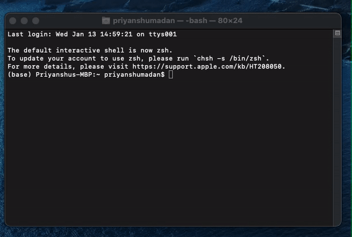
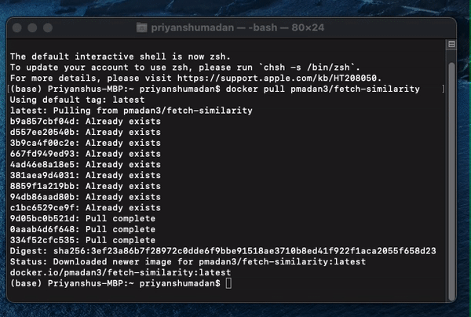
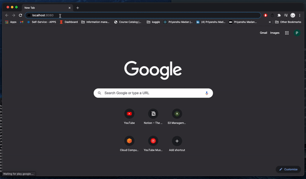
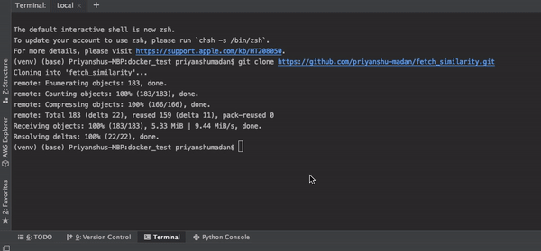

# Fetch Rewards Coding Exercise - Data Engineer
This challenge will focus on the similarity between two texts. Your objective is to write a program that takes as inputs two texts and uses a metric to determine how similar they are. Documents that are exactly the same should get a score of 1, and documents that don’t have any words in common should get a score of 0.

## Installation process

### 1) Running via Docker Hub

#### Step 1. Download and install Docker for desktop: https://www.docker.com/products/docker-desktop

Installation video: https://www.youtube.com/watch?v=LtooWDUL1Js&ab_channel=NRDYTech

#### Step 2. Running Fetch Rewards Coding Exercise

Once the installation is complete. Open terminal / command-prompt and type in the following command:

```cmd
docker pull pmadan3/fetch-similarity
```

It will look something like this



Next, we want to run the pulled docker container. Type in the following command:

```cmd
docker run --rm -p 8080:8080 pmadan3/fetch-similarity
```


When the command is successful, open your web browser and type in the following URL:

http://localhost:8080/

#### It will look something like this. Type in your texts as shown below and check their similarity



### Docker Repository link: https://hub.docker.com/r/pmadan3/fetch-similarity/builds

### 2) Running via GitHub pull

Open Terminal in a directory (I am opening mine in a Pycharm project).

In the terminal type the following commands one by one:

```cmd
git clone https://github.com/priyanshu-madan/fetch_similarity.git
cd fetch_similarity
pip install -r requirements.txt
python flask_page.py
```
Click on the link generated after the run as shown below:




